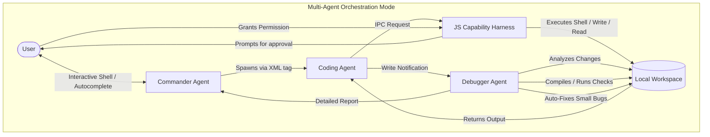

# A.N.A.N.D - Node.js CLI Chatbot (with Multi-Agent Orchestration & Autocomplete)

A terminal-based chatbot built with Node.js that connects to Google Gemini, OpenAI, Anthropic, NVIDIA, and Ollama. It features a custom interactive shell prompt that intercepts keypresses to offer dynamic command suggestions, multi-agent capabilities, and auto-debugging.


---

## 🏗️ System Architecture

A.N.A.N.D operates as a secure, decoupled orchestration system where the chatbot and its spawned agents communicate with the local file system and shell command runner through an IPC Capability Harness.



---

## 🚀 Installation & Global Access

### Option 1: Install via npm (Recommended)
To download and install the CLI tool globally from the npm registry:
```bash
npm install -g anandcli
```

### Option 2: Install from Source (GitHub)
If you want to clone the repository and run it locally:

1.  **Clone the repository**
    ```bash
    git clone https://github.com/ashu90-prog/anand-cli-chatbot.git
    cd anand-cli-chatbot/NodeJS
    ```

2.  **Install dependencies and register globally**
    ```bash
    npm install
    npm link --force
    ```

---

### Launching the Tool
Once installed using either option, simply type `anand` in any terminal window and press Enter to launch the chatbot:
```bash
anand
```

---

## ⚡ Key Features & Performance

### 1. High Speed & Low-Latency UI
*   **Sub-Millisecond Keypress Interception**: Using Node's native `readline` module in raw mode, keypresses are captured instantly. Command suggestion overlays filter and render underneath your cursor on the fly, introducing absolutely zero typing lag.
*   **Rapid Live Search**: Paginated model pickers filter hundreds of available API models instantly as you type characters into the `Search >` prompt.
*   **Fast Asynchronous IPC**: Spawned Coding and Debugger subagents run in isolated child processes and stream outputs back via Node.js IPC channels.

### 2. Autonomous Multi-Agent Orchestration (`/algo`)
When placed in Algorithm Mode (default), the chatbot operates as a multi-agent hierarchy:
*   **Commander Agent**: The user-facing agent. It plans the execution of complex coding tasks and coordinates the work of subagents.
*   **Coding Agent**: Spawns using `<spawn_agent model="model_name" debugger_model="model_name">`. It writes files, reads resources, and runs CLI build commands.
*   **Debugger Agent**: Automatically spawned whenever a Coding Agent writes or modifies files.
    - **Self-Healing**: It reads the modified code, runs compilation/lint/run tests, and immediately resolves basic syntax or reference errors itself using `<write_file>`.
    - **Escalation**: For logical design errors or requirements conflicts, the Debugger generates a structured diagnostic report and escalates it to the Commander.

### 3. Traditional Single-Agent Mode (`/normal`)
*   Provides a direct, single-chat assistant (`A.N.A.N.D > `) that does not spawn subagents.
*   Retains the ability to invoke direct capabilities (like running shell commands, reading workspace files, or writing content) when requested using the XML tags.

### 4. Searchable Pickers & Defaults
*   **Live Menus**: Selection menus (such as `/models`, `/coding-models`, `/debugger`, and `/provider`) render with a real-time `Search > ` filter input.
*   **Smart Defaults**: Remembers your last-used provider, model, and debugger model configurations, highlighting them automatically when selection menus are opened.

### 5. Decoupled Capability Harness (Security)
*   **Sandbox Isolation**: Chat sessions run in child processes. They cannot touch the file system or run commands directly.
*   **Interactive Prompts**: All capability requests are intercepted by `harness.js` which prompts you to confirm permissions (`Allow Once`, `Always Allow`, `Reject`) using arrow keys.
*   **Session Whitelist**: Choosing "Always Allow" whitelists that specific command, preventing future prompts during the active session.

---

## 🛠️ Commands & Keyboard Shortcuts

Inside the chatbot, you can use these commands or press `Ctrl + X` followed by the shortcut key:

| Command | Shortcut | Description |
| :--- | :--- | :--- |
| `/help` | `Ctrl + X h` | Show command help |
| `/editor` | `Ctrl + X e` | Open multi-line text editor |
| `/models` | `Ctrl + X m` | List and select models for the current provider (includes search bar) |
| `/coding-models` | `Ctrl + X g` | Configure a pool of models for Coding Agents (includes search bar) |
| `/debugger` | `Ctrl + X d` | Select the model for the Debugger Agent (includes search bar) |
| `/algo` | *None* | Switch to Multi-Agent Algorithm mode |
| `/normal` | *None* | Switch to Normal Chatbot mode |
| `/terminal` | `Ctrl + X t` | Open interactive terminal shell |
| `/provider` | `Ctrl + X p` | Switch active provider (Gemini, OpenAI, Anthropic, NVIDIA, Ollama) |
| `/init` | `Ctrl + X i` | Initialize `AGENTS.md` rules in the workspace |
| `/compact` | `Ctrl + X c` | Compact the context history |
| `/sessions` | `Ctrl + X l` | List all saved chat sessions |
| `/system` | `Ctrl + X s` | View or update active system prompt |
| `/history` | `Ctrl + X y` | Show current session history or export it to Markdown |
| `/clear` | `Ctrl + X o` | Clear context history and reset terminal |
| `/exit` | `Ctrl + X q` | Terminate the session |

---

## 📂 Configuration Options (`config.json`)

All configuration parameters are stored globally in `~/.cli-chatbot/config.json`. Below is the schema structure:

```json
{
  "provider": "gemini",
  "model": "gemini-2.5-flash",
  "mode": "algo",
  "debugger_model": "gemini-2.5-flash",
  "system_prompt": "You are a helpful assistant.",
  "api_keys": {
    "gemini": "YOUR_GEMINI_KEY",
    "openai": "YOUR_OPENAI_KEY",
    "anthropic": "YOUR_ANTHROPIC_KEY",
    "nvidia": "YOUR_NVIDIA_KEY"
  },
  "coding_models": [
    "gemini-2.5-flash",
    "gemini-2.5-pro"
  ]
}
```

---

## 🔧 Developer Guide: Extending Providers

To add a new API provider to the CLI, extend `BaseProvider` inside `providers.js` and register it in `ProviderManager`:

1.  **Define the Provider Class**:
    ```javascript
    export class MyNewProvider extends BaseProvider {
      constructor(apiKey) {
        super();
        this.apiKey = apiKey;
      }
      
      async listModels() {
        // Return array of model IDs available for your provider
        return ['model-v1', 'model-v2'];
      }
      
      async *generateStream(systemPrompt, messages, model) {
        // Yield streamed chunks of assistant responses from the API
        yield "Response chunk";
      }
    }
    ```

2.  **Register the Provider** inside the `ProviderManager` switch block:
    ```javascript
    case 'myprovider':
      return new MyNewProvider(apiKey);
    ```
